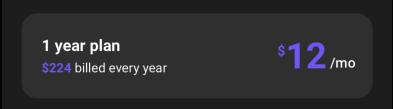
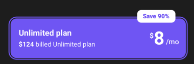

[](https://github.com/WrathChaos/react-native-subscribe-card)

[](https://www.npmjs.com/package/react-native-subscribe-card)
[](https://www.npmjs.com/package/react-native-subscribe-card)

[](https://opensource.org/licenses/MIT)
[](https://github.com/prettier/prettier)

<p align="center">
  
</p>

# Installation

Add the dependency:

```bash
npm i react-native-subscribe-card
```

## Peer Dependencies

Zero Dependency

# Usage

## Import

```jsx
import SubscribeCard from "react-native-subscribe-card";
```

## Fundamental Usage

<p align="left">
  
</p>

```jsx
<SubscribeCard
  title="1 year plan"
  descriptionPrice="$224"
  description=" billed every year"
  currency="$"
  price={12}
  timePostfix="/mo"
  onPress={() => {}}
/>
```

## Selected Customization Usage

`isSelected` prop makes the whole subscribe card changes to a new selected one.

<p align="left">
  
</p>

```jsx
<SubscribeCard
  isSelected
  title="Unlimited plan"
  descriptionPrice="$124"
  description=" billed Unlimited plan"
  currency="$"
  price={8}
  timePostfix="/mo"
  onPress={() => {}}
/>
```

## Discount / Save Optional Usage

`discountText` prop makes the available for the discount/save optional component.

<p align="left">
  
</p>

```jsx
<SubscribeCard
  discountText="Save 90%"
  title="Unlimited plan"
  descriptionPrice="$124"
  description=" billed Unlimited plan"
  currency="$"
  price={8}
  timePostfix="/mo"
  isSelected
  onPress={() => {}}
/>
```

## Example Project 😍

You can checkout the example project 🥰

Simply run

- `npm i`
- `react-native run-ios/android`

should work of the example project.

# Configuration - Props

## Fundamentals

| Property         |      Type       | Required |  Default  | Description                                                        |
| ---------------- | :-------------: | :------: | :-------: | ------------------------------------------------------------------ |
| title            |     string      |    ✅    | undefined | change the title                                                   |
| description      |     string      |    ❌    | undefined | change the descrition                                              |
| descriptionPrice | string / number |    ❌    | undefined | change the descrition price                                        |
| price            | string / number |    ✅    | undefined | change the price                                                   |
| currency         |     string      |    ✅    | undefined | change the currency icon such as `$`                               |
| timePostfix      |     string      |    ✅    | undefined | change the time postfix                                            |
| isSelected       |     boolean     |    ❌    |   false   | enable the selected styling                                        |
| discountText     |     string      |    ❌    | undefined | change the discount text                                           |
| onPress          |    function     |    ✅    | undefined | set your own logic for the button functionality when it is pressed |

## Customization (Optionals)

| Property                          |       Type       | Default | Description                                                                                                             |
| --------------------------------- | :--------------: | :-----: | ----------------------------------------------------------------------------------------------------------------------- |
| style                             |    ViewStyle     | default | set or override the style object for the styling                                                                        |
| containerStyle                    |    ViewStyle     | default | set or override the style object for the `container` style                                                              |
| selectedContainerStyle            |    ViewStyle     | default | set or override the style object for the `selected container` style (when the `isSelected` prop is enable)              |
| discountContainerStyle            |    ViewStyle     | default | set or override the style object for the `discount container` style                                                     |
| outerContainerStyle               |    ViewStyle     | default | set or override the style object for the `outer container` style                                                        |
| selectedOuterContainerStyle       |    ViewStyle     | default | set or override the style object for the `selected outer container` style (when the `isSelected` prop is enable)        |
| titleTextStyle                    |    TextStyle     | default | set or override the style object for the `title` text style                                                             |
| descriptionTextStyle              |    TextStyle     | default | set or override the style object for the `description` text style                                                       |
| descriptionPriceTextStyle         |    TextStyle     | default | set or override the style object for the `description price` text style                                                 |
| selectedDescriptionPriceTextStyle |    TextStyle     | default | set or override the style object for the `selected description price` text style (when the `isSelected` prop is enable) |
| currencyTextStyle                 |    TextStyle     | default | set or override the style object for the `currency` text style                                                          |
| selectedCurrencyTextStyle         |    TextStyle     | default | set or override the style object for the `selected currency` text style (when the `isSelected` prop is enable)          |
| priceTextStyle                    |    TextStyle     | default | set or override the style object for the `price` text style                                                             |
| selectedPriceTextStyle            |    TextStyle     | default | set or override the style object for the `selected price` text style (when the `isSelected` prop is enable)             |
| timeTextStyle                     |    TextStyle     | default | set or override the style object for the `time` text style                                                              |
| discountTextStyle                 |    TextStyle     | default | set or override the style object for the `discount` text style                                                          |
| TextComponent                     |       Text       | default | set your own component instead of default `React Native's Text` component                                               |
| TouchableComponent                | TouchableOpacity | default | set your own component instead of default `React Native's TouchableOpacity` component                                   |

## Future Plans

- [x] ~~LICENSE~~
- [ ] Write an article about the lib on Medium

## Credits

Big thanks to Maxim Sirotyuk. Heavily inspired by [Maxim Sirotyuk's Amazing Design](https://www.uplabs.com/posts/subscription-winner-screens-android)

## Author

FreakyCoder, kurayogun@gmail.com

## License

React Native Subsribe Card is available under the MIT license. See the LICENSE file for more info.
